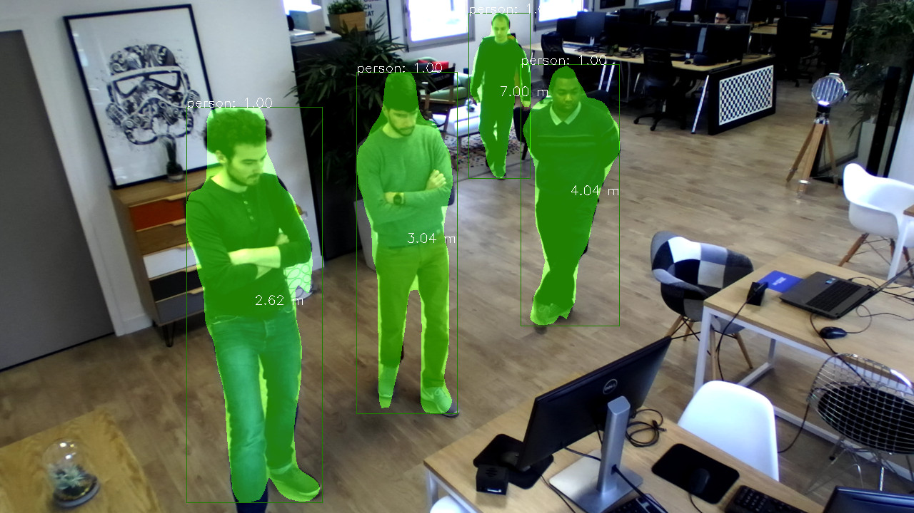

# 3D Mask R-CNN using the ZED and Pytorch

The ZED SDK can be interfaced with Pytorch for adding 3D localization of custom objects detected with MaskRCNN. In this Python 3 sample, we will show you how to detect, segmente, classify and locate objects in 3D space using the ZED stereo camera and Pytorch.

<!---   --->
<p align="center">
  
</p>

# Installation

## Dependencies

The 3D Object Detection project depends on the following libraries:

* Python 3
* CUDA
* ZED SDK (Python API)
* Pytorch
* OpenCV

## Getting Started

### ZED SDK Installation

Install the [ZED SDK](https://www.stereolabs.com/developers/release/) and the ZED [Python API](https://www.stereolabs.com/docs/getting-started/python-development/).

### Pytorch Installation

#### Using Conda (recommended)

The CUDA version must match the one used for the ZED SDK, in that case CUDA **10.0**.
A dedicated environment can be created to setup Pytorch, but don't forget to activate it, especially when installing MaskRCNN.

```bash
conda create --name pytorch1 -y
conda activate pytorch1
```

```bash
conda install pytorch torchvision cudatoolkit=10.0 -c pytorch
conda install --yes --file requirements.txt
```

#### Using Pip

```bash
pip3 install torch==1.4.0+cu100 torchvision==0.5.0+cu100 -f https://download.pytorch.org/whl/torch_stable.html
pip3 install -r requirements.txt
```

For more information please refer to this page https://pytorch.org/get-started/locally/.

### MaskRCNN Installation

```bash
python3 setup.py install
```

## Running the sample

We provide a simple webcam demo that illustrates how you can use `maskrcnn` for inference :


```bash
python zed_object_detection.py --config-file configs/caffe2/e2e_mask_rcnn_R_50_C4_1x_caffe2.yaml --min-image-size 256
```

```bash
# A SVO file can be loaded
python zed_object_detection.py --svo-filename path/to/svo_file.svo

# for best results, use min-image-size 800
python zed_object_detection.py --min-image-size 800

# or change the model that you want to use
python zed_object_detection.py --config-file configs/caffe2/e2e_mask_rcnn_R_101_FPN_1x_caffe2.yaml --min-image-size 300

# in order to see the probability heatmaps, pass --show-mask-heatmaps
python zed_object_detection.py --min-image-size 300 --show-mask-heatmaps

# for the keypoint demo
python zed_object_detection.py --config-file configs/caffe2/e2e_keypoint_rcnn_R_50_FPN_1x_caffe2.yaml --min-image-size 300

# can also run it on the CPU
python zed_object_detection.py --min-image-size 300 MODEL.DEVICE cpu
```

The model are downloaded automatically

## Model Zoo and Baselines

Pre-trained models can be found in [other/MODEL_ZOO.md](MODEL_ZOO.md)
